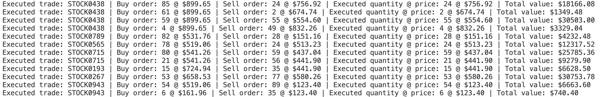

# Real-time Stock Trading Engine

## Project Overview

This project implements a real-time stock trading engine that matches buy and sell orders for multiple stock tickers. It's designed to handle concurrent transactions efficiently, simulating a real-world stock exchange environment.

## Setup and Installation

1. Clone the repository: 
```python
git clone https://github.com/khushalid/Stock-Trading-Engine.git
cd Stock-Trading-Engine
```

2. Create and activate a virtual environment:
```python
python -m venv env
source env/bin/activate # On Windows use `env\Scripts\activate`
```
3. Run the main.py file:
```python
python main.py
```

## Output Image:

<br>

## Understanding the Output
The output shows how orders are matched and executed:
1. Orders for the same stock (e.g., STOCK0112) are grouped together.
2. Buy orders with prices higher than or equal to sell orders are matched.
3. The quantity traded is the minimum of the buy and sell order quantities.
4. Multiple trades may occur for a single order if it's partially filled by multiple counterparties.

## Key Features

- Supports 1,024 unique stock tickers
- Concurrent order processing using multi-threading
- Custom implementation of lock-free data structures
- Efficient order matching algorithm with O(n) time complexity
- Simulation of active stock transactions

## Technical Stack

- Language: Python 3.x
- Concurrency: Threading
- Data Structures: Custom implementations (no use of built-in dictionaries or maps)


## Core Components

1. **TradingEngine**: Main class that handles order addition and matching.
2. **TickerArray**: Custom array implementation to store and manage 1,024 stock tickers.
3. **OrderList**: Lock-free linked list implementation for storing buy and sell orders.

## Key Functions

- `add_order(order_type, ticker_symbol, quantity, price)`: Adds a new order to the system.
- `match_order(ticker_symbol)`: Matches buy and sell orders for a given ticker.


